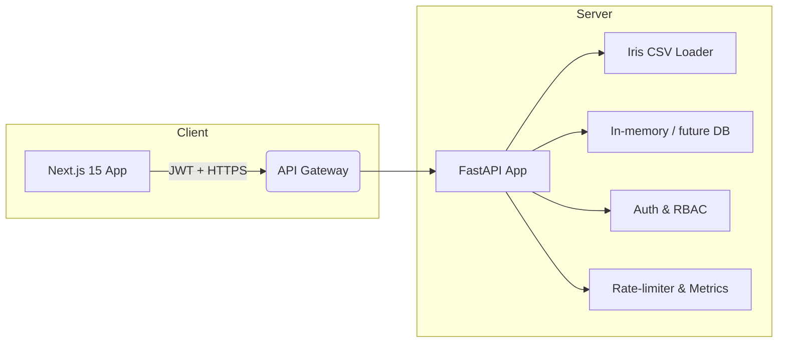

# Iris‑Data‑Demo

A **full‑stack reference application** that demonstrates best practices for building a modern data‑driven product with a Python **FastAPI** micro‑service and a **Next.js 15** (React 18) frontend.  The sample domain is the classic *Iris* flower data‑set, but the architecture can be adapted to any tabular data pipeline.

<p align="center">
  
</p>

---

## Table of Contents

- [Iris‑Data‑Demo](#irisdatademo)
  - [Table of Contents](#tableofcontents)
  - [Architecture](#architecture)
  - [Features](#features)
  - [Project Structure](#project-structure)
  - [Local Setup](#localsetup)
    - [Prerequisites](#prerequisites)
    - [Backend](#backend)
    - [Frontend](#frontend)
  - [Environment Variables](#environmentvariables)
  - [API Reference](#api-reference)
    - [Example](#example)
  - [Testing](#testing)
  - [Deployment Guides](#deploymentguides)
    - [Docker](#docker)
    - [Heroku](#heroku)
  - [Roadmap](#roadmap)
  - [License](#license)

---

## Architecture



* **FastAPI backend**

  * Typed Pydantic v2 schemas
  * JWT access / refresh tokens & optional API keys
  * Per‑species row‑level permissions (demo RBAC)  ([raw.githubusercontent.com](https://raw.githubusercontent.com/jsrobin888/iris-data-demo/main/backend/app/api/routes/data.py))
  * CORS, structured logging & Prometheus metrics
  * Ready for container or Gunicorn/Uvicorn deployment
* **Next.js 15 frontend**

  * `app/` router, React 18 Server Components
  * Tailwind CSS + shadcn/ui for UI, Chart.js 4 via react‑chartjs‑2 for visualisation
  * `iron-session` for secure http‑only cookie storage of JWTs
* CI‑ready folder layout keeps the two apps isolated while sharing a single repo.

## Features

| Area           | Details                                                                                                                                                                                                             |
| -------------- | ------------------------------------------------------------------------------------------------------------------------------------------------------------------------------------------------------------------- |
| Authentication | Register / Login / Refresh / Me endpoints (JWT, bcrypt)  ([raw.githubusercontent.com](https://raw.githubusercontent.com/jsrobin888/iris-data-demo/main/backend/app/api/routes/auth.py))                             |
| Data APIs      | Summary, per‑species data, statistics, pagination, normalisation, outlier filtering  ([raw.githubusercontent.com](https://raw.githubusercontent.com/jsrobin888/iris-data-demo/main/backend/app/api/routes/data.py)) |
| Rate Limiting  | Sliding‑window limiter (100 req / 60 s default)                                                                                                                                                                     |
| Caching        | Optional CSV preload & pandas memory cache                                                                                                                                                                          |
| Testing        | `pytest`, `httpx`, `pytest‑asyncio`                                                                                                                                                                                 |
| Dev‑Ex         | Live reload (`uvicorn --reload`, `next dev`), Pre‑commit hook set, Black & Flake8                                                                                                                                   |

## Project Structure

```
.
├── backend/                # FastAPI service
│   ├── app/
│   │   ├── api/routes/     # auth.py, data.py, health.py, admin.py
│   │   ├── core/          
│   │   ├── data/          
│   │   ├── models/        
│   │   └── config.py      # Pydantic Settings ([raw.githubusercontent.com](https://raw.githubusercontent.com/jsrobin888/iris-data-demo/main/backend/app/config.py))
│   └── requirements.txt   # Locked versions ([raw.githubusercontent.com](https://raw.githubusercontent.com/jsrobin888/iris-data-demo/main/backend/requirements.txt))
├── frontend/               # Next.js 15 web client
│   ├── app/ or pages/      # routes & layouts
│   ├── components/
│   ├── styles/
│   └── package.json        # TS + Tailwind + Chart.js deps ([raw.githubusercontent.com](https://raw.githubusercontent.com/jsrobin888/iris-data-demo/main/frontend/package.json))
├── runtime.txt             # Python version hint for Heroku (3.11)
└── .gitignore
```

## Local Setup

### Prerequisites

* **Python 3.11**
* **Node 18 LTS** & npm ≥ 9 (or pnpm / yarn)
* **Make** & **Git** (optional)

### Backend

```bash
cd backend
python -m venv .venv && source .venv/bin/activate  # Windows: .venv\Scripts\activate
pip install -r requirements.txt
cp .env.example .env  # edit secrets
uvicorn app.main:app --reload --host 0.0.0.0 --port 8000
```

Backend now lives at **[http://localhost:8000](http://localhost:8000)** (docs at `/docs`).

### Frontend

```bash
cd frontend
npm install  # or pnpm install
npm run dev   # http://localhost:3000
```

To point the React client at the local API, set `NEXT_PUBLIC_API_URL=http://localhost:8000` in `frontend/.env.local`.

## Environment Variables

| Variable                      | Default                 | Purpose                               |
| ----------------------------- | ----------------------- | ------------------------------------- |
| `IRIS_API_JWT_SECRET_KEY`     | *change‑me*             | Symmetric key for signing JWTs        |
| `IRIS_API_CORS_ORIGINS`       | `http://localhost:3000` | Allowed front‑end origins             |
| `IRIS_API_RATE_LIMIT_ENABLED` | `true`                  | Toggle rate limiter                   |
| `NEXT_PUBLIC_API_URL`         | `http://localhost:8000` | Base URL consumed by Next.js fetchers |

> See `backend/app/config.py` for **all** backend settings.

## API Reference

All endpoints are under **`/api/v1`** (except `/health`). The FastAPI Swagger UI lists schemas; here is a condensed map:

| Method | Path                   | Description                                                                        |
| ------ | ---------------------- | ---------------------------------------------------------------------------------- |
| GET    | `/health`              | Liveness probe                                                                     |
| POST   | `/auth/register`       | Create user                                                                        |
| POST   | `/auth/login`          | Obtain `access` & `refresh` tokens                                                 |
| POST   | `/auth/refresh`        | Rotate expired access token                                                        |
| GET    | `/auth/me`             | Current user info                                                                  |
| GET    | `/data`                | Summary of accessible rows                                                         |
| GET    | `/data/species/list`   | List species user can query                                                        |
| GET    | `/data/species/{name}` | Detailed records (query params: `normalize`, `remove_outliers`, `limit`, `offset`) |
| GET    | `/data/my-data`        | Shortcut to user‑scoped species                                                    |
| GET    | `/data/statistics`     | Aggregate stats (all or specific)                                                  |

All protected routes expect an **`Authorization: Bearer <accessToken>`** header.

### Example

```bash
curl -X POST http://localhost:8000/api/v1/auth/login \
  -H 'Content-Type: application/json' \
  -d '{"email":"setosa@example.com","password":"password123"}'
```

## Testing

```bash
cd backend
pytest -q  # runs ~50 unit & integration tests
```

Front‑end unit tests can be added with Jest & React Testing Library (TODO).

## Deployment Guides

### Docker

```bash
# Build images
docker build -t iris-api ./backend
docker build -t iris-web ./frontend
# Run
docker run -d -p 8000:8000 iris-api
docker run -d -p 3000:3000 --env NEXT_PUBLIC_API_URL=http://host.docker.internal:8000 iris-web
```

> A `docker-compose.yml` can glue the two services; see `deploy/docker-compose.yml` (coming soon).

### Heroku

1. Create two apps (`iris-api`, `iris-web`) or a single **container** stack app.
2. Set buildpacks: `heroku/python` then `heroku/nodejs` (multi‑procfile) or push Docker images.
3. Configure config‑vars as per [Environment Variables](#environment-variables).
4. `web: gunicorn app.main:app -k uvicorn.workers.UvicornWorker` for API, `web: npm run start` for Next.js.

## Roadmap

* 🎛️  Admin panel & Postgres persistence
* 📊  Additional charts (pair‑plot, correlation heat‑map)
* 🔐  OAuth 2 / SSO support
* ⚙️  GitHub Actions CI & CD pipeline with Cypress e2e tests

## License

[MIT](LICENSE) — feel free to fork & build on this starter!
